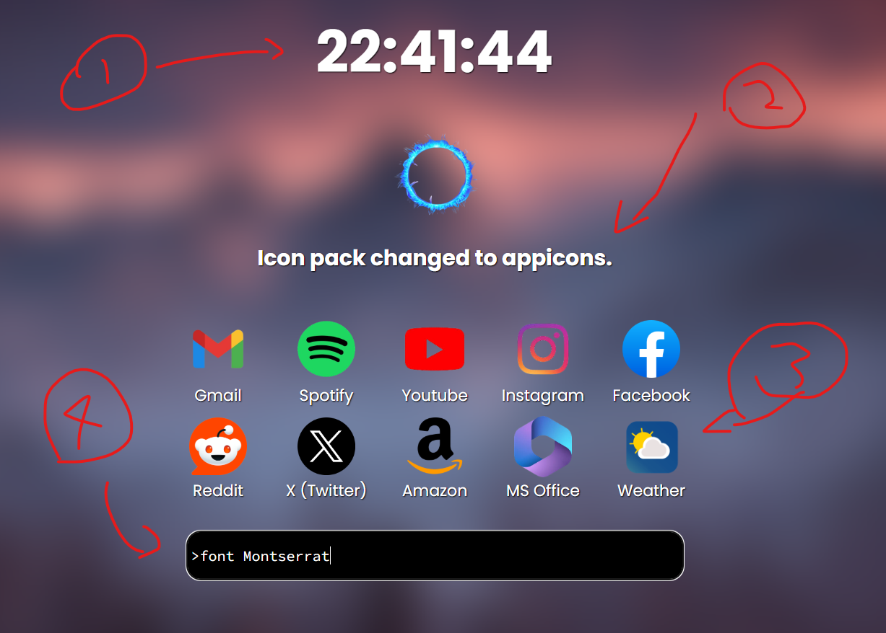

# Scr-OS Manual

## Getting started

### Installation

1. Click [here](https://github.com/Imeanbusiness/ScrOS/archive/refs/heads/main.zip) to download. The current version is `v1.2.1`, code name `Marina`.

2. Unzip the folder

3. Uncompress the folder

4. Open the folder and open scros.html

## Basics 

### 1: Clock

This tells time. By default, it is set to 24 hour. You can change this with the >fclock command. 

### 2: Command Output

This is the output of whatever commands you enter into the command panel. 

### 3: App Dock

These are the basic app icons you can click on to quickly navigate. Use the arrow keys on board to flip between pages. You an custoize the postiion and available apps on this. 

### 4: Command Panel (Input)

This is like a terminal where you enter in all you commands, which are analyzed by Terry before being output-ted onto the Command Output text area.

## Functions 

### Quick Research

In Chat Mode, you can access Google straight through Terry. You will need your own API key. 

### Convenience

You can ask Terry to open up sites for you, or google search if it's something he doesn't know. You can use terry to quickly search on Spotify and Youtube.

### Commands

You can run commands on Terry to make him work specifically.

### Customization

Running commands allows you to change up settings with the start up screen, whether it's the font family, background picture, font color, and more!

## Other notes

### Issues 

Please report any issues that you may have with Scr-OS to me on Scr-OS' GitHub. Run `>gh` to directly go to the Scr-OS GitHub page.

## Commands 

Here is a list of every command and how to use it. 

## 🎨 Customization

| Command | Description |
|--------|-------------|
| `>bgc (filename)` | Set the background to a specific image. Image must be in the `Images` folder. Example: `>bgc BG2.png` |
| `>vbgc (filename)` | Set the background to a specific image. Image must be in the `Videos` folder. |
| `>bgmode` | Toggle between your animated and static backgrounds. Static is on by default. |
| `>fontcolor (color)` | Set the font color. Accepts hex codes or CSS color names. |
| `>outlcolor (color)` | Set the font outline color. Accepts hex codes or CSS color names. |
| `>font (font name)` | Set the font family. Example: `Nunito`, `Arial`. Scr-OS currently supports 29 fonts: Montserrat, Noto Sans, Nunito, Open Sans, Roboto, Ubuntu, Poppins, Homenaje, Pixelify Sans, Raleway, Source Code Pro, Bebas Neue, Orbitron, Lato, Inter, Spectral, Merriweather, Alegreya, Rokkitt, Oswald, Ultra, Roboto Flex, Fira Sans, Source Sans 3, EB Garamond, Jost, Rubik, Work Sans, Frank Ruhl Libre |
| `>iconpack (folder name)` | Change the icon set. All icons should follow the format `AppIcons/AppName.png`. (Twitter must be named `Twitter.png`) |
| `>remove (slot)` | Removes an app from the app dock on the current page. There are only slots 1 to 10. |
| `>replace (slot) (appname)` | Replace a slot from the app dock on the current page with the app you request. Please submit an issue on GitHub if you would like to see more apps. |
| `>showclock` | Toggle the clock. |
| `>showseconds` | Toggle whether you can see seconds or not on the clock. |
| `>showdock` | Toggle the app dock. |
| `>switchdock` | Switch the app dock and input positions. |
| `>pgs (pages)` | Set your desired page count for your app dock. The minimum is 1, and the maximum is capped at 4 (for now).|
| `>dockmode` | Toggle between fluid and simple dock modes. |
| `>lockdock` | Lock the fluid dock in place |
| `>appadd (appname)` | Add your own apps to the list of supported apps. Copy down the desired site location of your app before proceeding. For example, `https:/discord.com` is copied. Head into Scr-OS and add your app name. Note that everything except the first letter will automatically be lowercased. The first letter is always uppercased. Example: `>appadd Discord`. Proceed to paste the destination link into the prompt. Do not exit the page. You will need to add your own icons to your current iconpack. the format should be `Appname.png`. For example, if I am using AppIcons, I will put `Discord.png` inside AppIcons. The exact name of your app should be used. |
| `>appremove (appname)` | Remove an App from the list of supported apps. Make sure you use the exact name. |
| `>inpos (x value) (y value)` | Position the user input anywhere on the screen. Note that after using this, `>switchdock` will not save. Use this with caution. X and Y are based on the % height and width of your screen respectively. |
| `outnpos (x value) (y value)` | Position the output anywhere on the screen. |
| `clocknpos (x value) (y value)` | Position the clock anywhere on the screen. |
---

## 🛠️ Assistance

| Command | Description |
|--------|-------------|
| `>help` | View this help menu. |
| `>kill` | Exit Scr-OS. |
| `>gh` | Open the Scr-OS GitHub repository. |
| `>status` | Show Scr-OS version and system status. |
| `>settings` | View your current settings. |

---

## 🔍 Search & Web

| Command | Description |
|--------|-------------|
| `>gs (query)` | Google Search the provided query. |
| `>yt (query)` | Search YouTube for the query. |
| `>ms (query)` | Search Spotify for the song/query. |
| `>ops (site)` | Open a website. Example: `>ops amazon.com` |

---

## ⚙️ System Utilities

| Command | Description |
|--------|-------------|
| `>calc (expression)` | Math evaluator. Supports functions like `sqrt`, `sin`, `pi`, `log`. |
| `>calcds (maximum denominator)`| Sets up a maximum denominator value for simplifying to fractions. Must be between 1 and 1000. Keep in mind that the calculator will run exponentially slower per higher value.|
| `calcmode` | Switch between degrees and radians. Radians are on by default |
| `>compchk (number)` | Composite checker. Lists all factors and tells if the number is prime. |
| `>reset` | Reset Scr-OS memory to default. Requires running twice to confirm. |
| `>fclock` | Toggle between 12-hour and 24-hour clock format. |
| `>textms (delay)` | Set a delay during text generation in milliseconds (ms). Must be within 0 to 100. |
| `>api` | Enter your own API to use some chat functions. You can get your own API [here](https://developers.google.com/custom-search/v1/overview) |

---

## 💬 AI/Chat Features

| Command | Description |
|--------|-------------|
| `mode` | Toggle between "chat mode" and "search mode". In chat mode, asking Terry questions will return short, top results. |
| `dmode` | Decides whether "chat mode" or "search mode" is set as default during startup. |

---

## Patch Notes 

## Scr-OS Marina (Version 1.2.1 (Positioning)) 

- Added custom positioning for the input, output, and clock
- Scroll wheel can not be used to flip pages
- Fixed `>switchdock` inconsistencies when fluid dock is enabled.

## Scr-OS Marina (Version 1.2.0) 

- Background type can now be toggled between video and static
- The dock bar has become much more customizable. The maximum number of pages has doubled, going from 2 to 4.
- You can now position the dock bar at the bottom, left, and right with `>dockmode` and `>dockpos`. You can toggle them to stay in place or pop up when your mouse is close enough with `>lockdock`. This may not work as well on smaller screens or windows.
- You can now change what apps are supported and add your own icons for bookmarks, etc.
- You can now toggle seconds being displayed on the clock.
- The calculator now has an improved fraction mode.
- 29 fonts are now supported, detailed in the ReadMe file.

## Scr-OS Recto (Version 1.1.2 + 1.1.3)

- Calculator with new fractions feature
- Added degrees mode to calculator
- Added option to use own API key
- `>reset` dmode missing fix

## Scr-OS Recto (Version 1.1.0 (App Dock Changes))

- New App Dock pages and more customizability added.
- Smoother Chat functions
- Smoother load animations
- Added default mode switching
- `>reset` bug fixes

## Scr-OS Release (Version 1.0)

- First official release